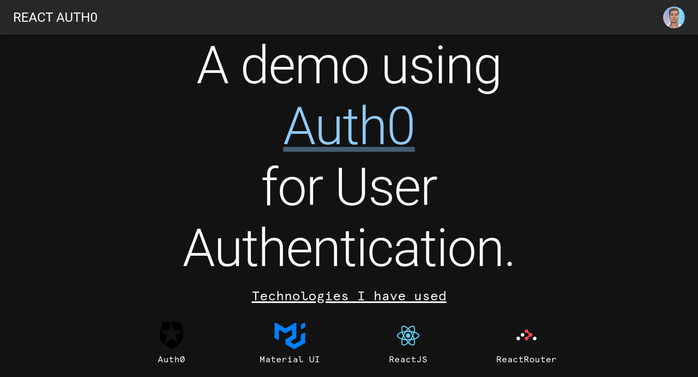

# React Auth0 Integration
> Nothing fancy. Just a website built with React using Auth0 for authentication and Authorization

## Table of contents
* [General info](#general-info)
* [Screenshots](#screenshots)
* [Technologies](#technologies)
* [Setup](#setup)
* [Features](#features)
* [Status](#status)
* [Inspiration](#inspiration)
* [Contact](#contact)

## General info
I had a project a while back and had to implement Authentication and Authorization from scratch. It was a nightmare. 

I stumbled upon Auth0 as I was learning to use Hasura. I used Auth0 to connect to the Hasura database API to manage authorization and authentication to my backend.

I finished the task at hand but had no grasp of how Auth0 worked. So I thought it  might be a good idea to try it out. At the time, I was learning React so why not? Hence this website.

## Screenshots

## Technologies
* React
* Auth0
* React Router
* Material UI

## Setup
Do you want to see how the code runs on your local machine. Just do the basics;

1. Clone the repository with git.
2. Open the project folder and run `yarn` from the terminal/command line.
3. Start a dev server with `yarn start`. 
4. The browser will launch automatically and navigate to http://localhost:3000.

## Features
List of features ready and TODOs for future development
* User Sign in and Sign up with Email-Password or Google.
* View Logged in User profile information.
* Save user theme preference.

To-do list:
* Create a global state to manage logged in user data
* Update the global state when user preference is saved.

## Status
Project is a work _in progress_.

## Contact
Created by [@iamJunox](https://www.twitter.com/iamJunox) - feel free to contact me!